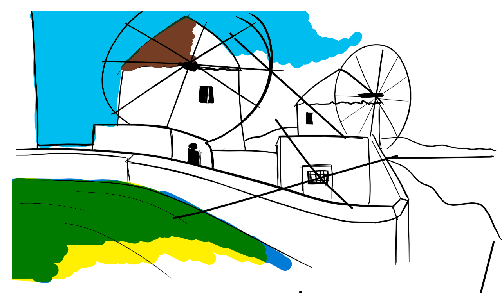

```{r setup, include=FALSE}
knitr::opts_chunk$set(echo = FALSE)
```

# In the morning

## Getting up

- Turn off alarm
- Get out of bed

## Breakfast

- Eat eggs
- Drink coffee

# In the evening

## Dinner

- Eat spaghetti
- Drink wine

----

This slide has no heading

## Going to sleep

- Get in bed
- Count sheep

# Types of slides

## Slide with text

This is an R Markdown presentation. Markdown is a simple formatting syntax for authoring HTML, PDF, and MS Word documents. For more details on using R Markdown see <http://rmarkdown.rstudio.com>.

When you click the **Knit** button a document will be generated that includes both content as well as the output of any embedded R code chunks within the document.

## Slide with bullets


>- this is NOT an incremenetal bullet
>- Also not incremental

- Incremental Bullet 1
- Incremental Bullet 2
- Incremental Bullet 3


## Slide with R Output

```{r cars, echo = TRUE}
summary(cars)
```

## Slide with Plot

```{r pressure}
plot(pressure)
```

## Slide with Two Column Content 

::: columns

:::: column
Some text on the left pane

- This is first point
- This is second point
::::

:::: column
Some text on the right pane

```{r your-chunk-name, echo=FALSE, fig.cap="your-caption-name"}


#The figure will appear on the right side of the slide...
```
::::

:::

----

Slides with nested bullets


## This nests, and increment

- Bullet 1
- Bullet 2
    + subbullet 1
    + subbullet 2

## This does not increment, but nests

>- Bullet 1
>- Bullet 2
>    - subbullet 1
>    - subbullet 2


